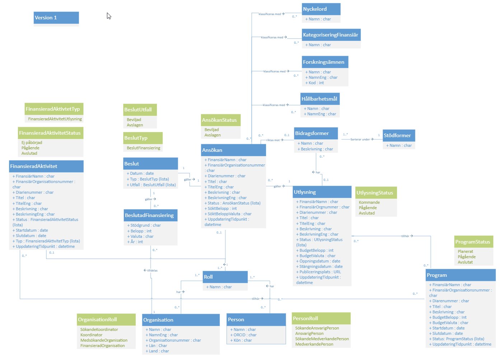

<!-- README.md is generated from README.Rmd. Please edit that file -->

```{r, include = FALSE}
knitr::opts_chunk$set(
  collapse = TRUE,
  comment = "#>",
  fig.path = "man/figures/README-",
  out.width = "100%"
)
```

# gdp

<!-- badges: start -->
[](https://github.com/KTH-Library/gdp/actions/workflows/R-CMD-check.yaml)
[](https://lifecycle.r-lib.org/articles/stages.html#experimental)
<!-- badges: end -->

The goal of gdp is to provide some tools and resources which are useful when working with data from the GDP project.

The client provided in the `gdp` R-package accesses data from an API described here:

- https://portal.api.vinnova.se/gdp-openapi-dokumentation
- https://gdpswagger.vinnova.se/
- https://portal.api.vinnova.se/gdp-openapi-dokumentation

Access to the API can be requested at https://portal.api.vinnova.se. This client makes use of a system account which provides access to the open data provided through the API.

Version 1 of the API conforms to this information model:



## Installation

You can install the development version of gdp from [GitHub](https://github.com/) with:

``` r
# install.packages("devtools")
devtools::install_github("KTH-Library/gdp")
```

## Examples

This is an example showing how to convert data from the GDP API to rectangular data which can be persisted locally in a relational database:

```{r example, eval=FALSE}
library(gdp)

my_orgid <- "202100-3054"  # KTHs organisation id used in GDP

# harvest data for the given organisation identifier
harvest <- gdp_harvest(organisation = my_orgid)

# export the data into a local database (duckdb, see https://duckdb.org)
destination_dir <- gdp_export_database(harvest)

# export the resulting tables individually as .csv and .parquet
gdp_export_tables(harvest, destdir = "/tmp/gdp")

```

This example shows how to search for proposals/applications across a few different topic areas:

```{r, eval=FALSE}
library(gdp)
library(tidyverse)

# use filters to extract data

my_orgid <- "202100-3054"  # KTHs organisation id used in GDP

my_proposals <- 
  gdp_proposals(filter = gdp_filter(type = "proposals", org_id = my_orgid)) |> 
  gdp:::to_tbls_proposals()

# proposals related to transport systems and logistics or has code which begins w "2.1.04"
my_proposals$topics |> 
  filter(topic_name_eng == "Transport Systems and Logistics" | 
    grepl("^2[.]1[.]0[4]", topic_code)) |> 
  distinct(id_proposal, topic_code, topic_name_eng) |> 
  left_join(my_proposals$proposals) |> 
  select(id_proposal, title, req_amount, topic_code) |> 
  arrange(desc(req_amount))

```
